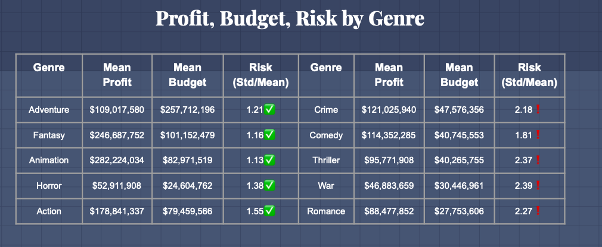

# Analyzing Risk Within Movie Genres

Contributors: [Samuel Mohebban](https://github.com/HeeebsInc) and [Michael Wang]
## Packages 

```python 
import matplotlib.pyplot as plt
import pandas as pd 
import seaborn as sns
import scipy.stats as sci
import numpy as np
```

If a company is trying to enter the movie industry or create their first film, they must consider budget.  Considering movies do not have unlimited budget, you can approach this problem using a risk analaysis for each Genre.  
[Google Slide Presentation](https://docs.google.com/presentation/d/17Ba26seyYSHHLWh5TLBRsJbAz1YpsoQI2lYNyWAq4Ok/edit?usp=sharing)

## Directory

- data.zip --> Contains MovieLens and TMBD DataSets
- UsedData --> Contains Clean Data Used For Plottig 
- Technical Notebook --> Contains Plotting + Parsing Functions

## Goals


- Use existing data from [MovieLens](https://grouplens.org/datasets/movielens/) and [TMBD](https://www.kaggle.com/juzershakir/tmdb-movies-dataset) to determine if there is a difference in risk between genres
    - **Risk** is defined as the standard deviation divided by the mean
- Determine correlations between profit and budget within each genre
- Understand the distribution within each genre and whether there is noise in our dataset

## Exploratory Analysis (Plots)
### Profitable vs. Unprofitable Movies (3D Scatter Plot) 
[Functions](Notebooks/TechnicalNotebook.ipynb)

Looking at the scatter plot, we see a high correlation between budget and profit; which was expected. As a movie spends more money on production, they overall profit will also increase.  However, looking at the correlations alone do not tell us the distribution between genres, and whether there is any noise. 


**Strong Correlation**                 
- Adventure                         
- Thriller 
- Crime 

**Moderate Correlation**                           
- Drama 
- Fantsay


### Box-Plot (Distributions)
Looking at the box plot we see that genres such as Action, Comedy, Fantasy, Animation, and Adventure show a favorable success rate, as a majority tend to fall above the median profit.  However, this graph also shows that there is a lot of noise within the data, which may have affected our later risk analysis.  


### Risk Analysis By Genre
Here, we calculated a risk value for each genre by dividing the standard deviation of profits, over the mean profit.  What this does is allow us to calculate the probability that a movie will deviate from the mean of its genre.  Furthermore, a lower risk value is more favorable as it shows that the genre is less likely to deviate from its mean profit - being a safer pick. 


### Recommendations for Movies 
- Budget over $200,000,000: 
    - Action 
    - Adventure
- Budget under $200,000,000: 
    - Comedy 
    - Horror

### Final Look


## Conclusion 


## Limitations
- Data used contained movies from 1990-2017; more recent movies could have showed different results 
- Many movies have unknown budgets, so they were ignored
- Within every popular movie genre, there are extreme outliers that may have contributed to exaggerated standard deviations.  

